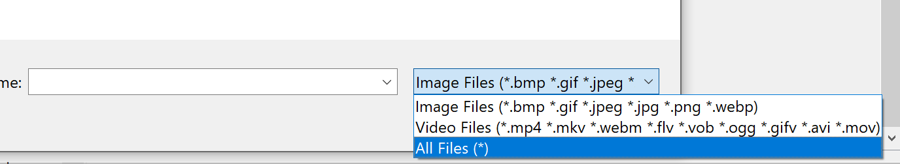

# Boardy3
Boardy3 is an alternative version of [Boardy2](https://github.com/disbxys/boardy2) that uses PyQt6 as the primary framework to display your image collection in a gallery.

[](https://github.com/disbxys/boardy3/actions/workflows/release.yml)

## Dependencies
```
Python
PyQt6
python-magic
SQLAlchemy
```

### Missing Libmagic
There is a good chance that you will run into this error

```
File "C:\Users\default\AppData\Roaming\Python\Python3\site-packages\magic\loader.py", line 49, in load_lib
    raise ImportError('failed to find libmagic.  Check your installation')
ImportError: failed to find libmagic.  Check your installation
```

#### Windows

You can fetch the DLLs for Windows for libmagic from @julian-r with
```
pip install python-magic-bin
```

Make sure to have this installed **AFTER** installing `python-magic`. Otherwise, you can run into the same error.

#### Other OSs
Refer to https://github.com/ahupp/python-magic#installation for more information


## How to Run
This program can simply be run by running `launch.py`.

## Supported Media Formats
Boardy3 by default supports the following image formats:
- bmp
- jpeg/jpg
- gif
- png
- webp

Most other image formats are also supported. If you cannot find the image you're looking for, try changing the file filter from **Image Files** to **All Files (*)**.



## Migrating to Boardy2
If you want switch to hosting your media on a web app, you can migrate your data to [Boardy2](https://github.com/disbxys/boardy2).

First clone the repo and cd into the directory where the repo is located.
```
git clone https://github.com/disbxys/boardy2.git

cd boardy2
```
From there, copy the `instance` and `db` folders from the root directory in your `boardy3` folder and paste them in the root directory folder in your `boardy2` folder.

After ```pip install``` to install all needed dependencies, you should be able to see all of your images when you run `launch.py`.

## Q & A
Q: Why do I need to install python-magic like this? I've seen other people try this method and it works.\
A: You might be right in that there other methods that could work. However, this was the most consistent method I have found and it works for me. You can try other methods if you want, but I'm not taking responsibility for that.

Q: What is going to happen to Boardy2?\
A: Going forward, I'll probably be working on it on and off. Right now, I want to focus on Boardy3.

Q: Boardy2 and Boardy3 are pretty much the same, why don't you combine the two?\
A: The reason is ultimately due to how flask operates sqlalchemy. I would have to create a separate database manager for PyQt6 and Flask each, at which point there is no use in combining the two apps in the first place.

Q: Which do you recommend I use?\
A: If you want to host your images on your local network, then go with Boardy2. If you want to only have it on your computer, then use Boardy3. Ultimately, <strong>the choice is your's</strong>.


## Related Projects

- [Boardy2](https://github.com/disbxys/boardy2) (flask alternative version)
